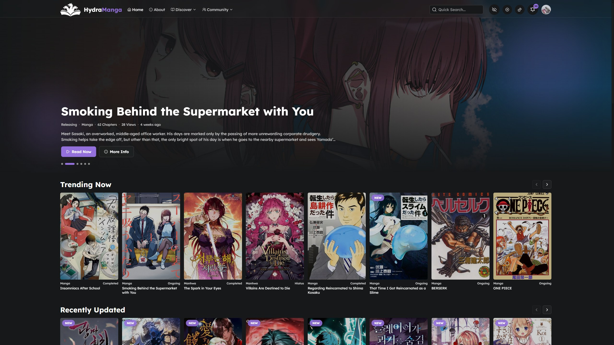
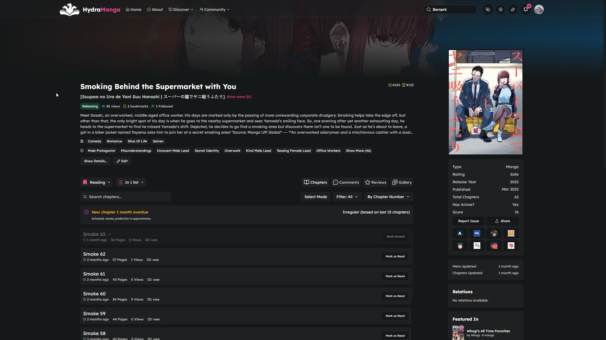
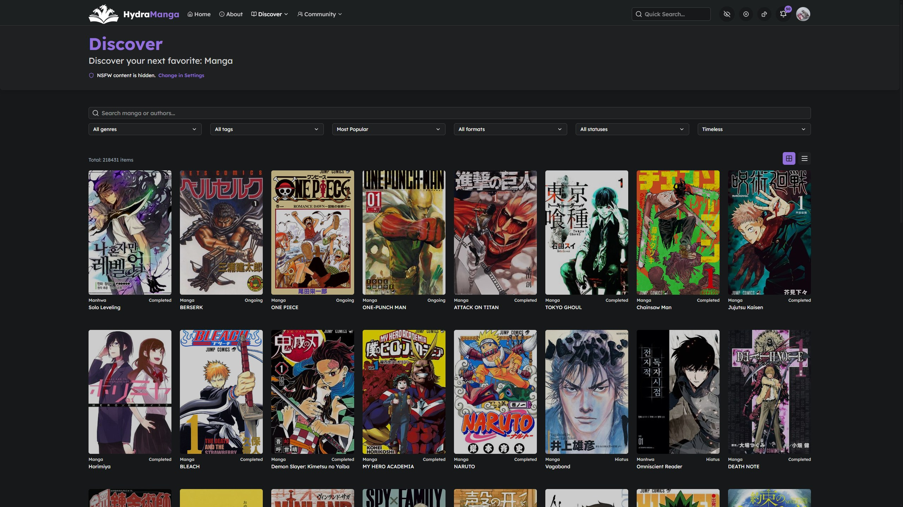
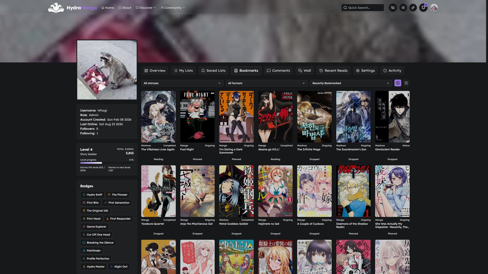
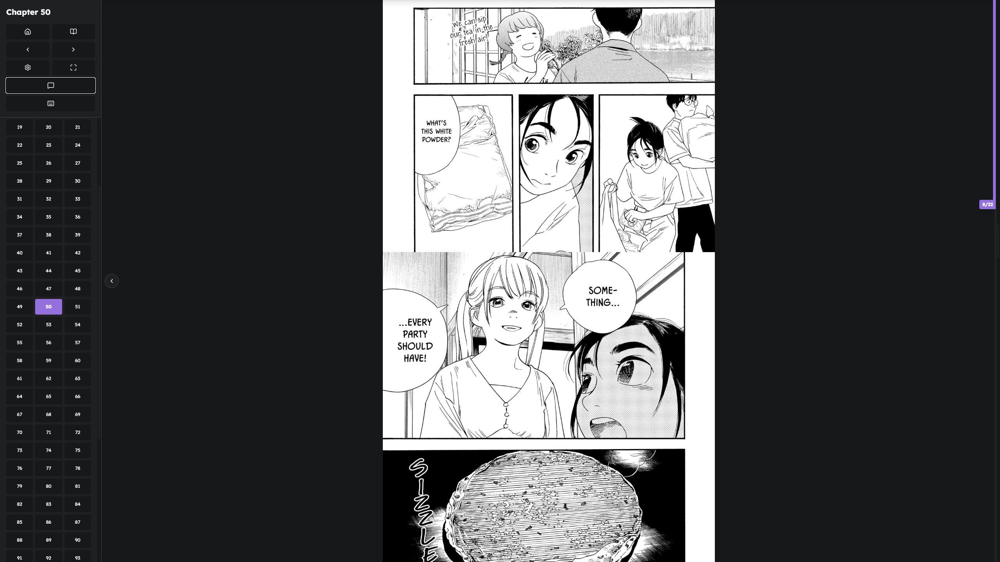
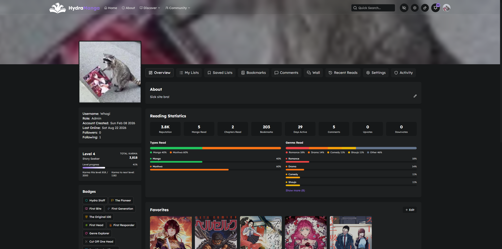

<p align="center">
  
</p>

<h1 align="center">HydraManga</h1>

<p align="center"><strong>Unleash your next obsession.</strong></p>

<p align="center">
  A community-driven platform to discover, read, track, and discuss manga, manhwa, and manhua — with a customizable reader, personal libraries, and a live community layered on top.
</p>

<p align="center">
  <a href="#demo">Demo</a> ·
  <a href="#screenshots">Screenshots</a> ·
  <a href="#overview">Overview</a> ·
  <a href="#features">Features</a> ·
  <a href="#architecture">Architecture</a> ·
  <a href="#tech-stack">Tech stack</a>
</p>

---

## Demo

A short demo exploring the app.
<p><a href="https://youtu.be/MFsauxJy0l4">Watch the demo</a></p>

---

## Screenshots

<p align="center">
  
</p>
<p align="center"><sub>Homepage — hero, trending, and recently updated</sub></p>

<br />

<p align="center">
  
</p>
<p align="center"><sub>Series page — details, chapters, lists, and tracking</sub></p>

<br />

<p align="center">
  
  &nbsp;
  
</p>
<p align="center"><sub>Discover catalog · Bookmarks and reading library</sub></p>

<br />

<p align="center">
  
  &nbsp;
  
</p>
<p align="center"><sub>Reader · Profile with stats, badges, and favorites</sub></p>

---

## Overview

HydraManga is a full-stack manga platform built for readers who want more than a catalog. Browse a growing library of manga, manhwa, and manhua, pick up exactly where you left off, and take part in a community that reviews, discusses, and ranks what they love.

It is a passion project: free accounts, no ads, and no paid gates. Metadata is aggregated from multiple sources; chapters are ingested, transcoded, and served from object storage through a custom pipeline.

The live site is **[hydramanga.com](https://hydramanga.com)**.

---

## Features

### Discover & catalog

- Homepage with hero series, trending, recently updated, popular, and top-rated carousels
- Full catalog search with genre, tag, type, status, and sort filters
- Genre collections and author pages
- Weighted scoring for default discover ranking
- Per-user NSFW filtering, plus site-wide content rules

### Reader

- In-browser reader with progress saved to your account
- Reading directions: top-to-bottom, left-to-right, and right-to-left
- Continuous scroll or paginated mode, tap zones, sticky header
- Auto-scroll, image gap, padding, greyscale, and page dimming
- Keyboard shortcuts and a reading-history view with stats
- Installable PWA for an app-like experience on desktop and mobile
- Built in comment system for individual manga chapters as well as full mangas

### Library & progress

- Default lists — Unread, Reading, Finished, Dropped — plus custom lists
- Bookmarks, continue-reading, and chapter-level progress sync
- Shareable public profiles with reading stats, badges, and a profile card
- Account data export and import

### Community

- Series reviews and threaded comments (with spoiler support)
- Community forum for longer discussion
- Realtime chat with presence, markdown, and stickers
- Karma, levels, and badges for reading and participation
- Site-wide leaderboard
- Notifications for replies, import requests, and new chapters
- Google and Discord sign-in, plus email auth

### For operators

- Admin overview, catalog tools, import-request review, and job queues
- User management, audit log, sticker library, and site settings
- Discord webhooks for public releases and admin events
- Object storage for chapter pages, avatars, and stickers (S3-compatible)

---

## Architecture

- **Web** — Next.js App Router. Pages stay on Next; `/api/*` is rewritten to Express.
- **API** — Express 5 with Better Auth, REST, and Socket.IO (`/progress`, `/chat`).
- **Worker** — BullMQ jobs for catalog scans, chapter ingest, and storage cleanup.
- **Data** — PostgreSQL (Drizzle ORM) and Redis.
- **Media** — Chapter pages, avatars, and stickers in S3-compatible buckets. The browser loads chapter images directly from the public bucket endpoint.

---

## Tech stack

| Layer         | Stack                                                  |
| ------------- | ------------------------------------------------------ |
| Client        | Next.js 16, React 19, Tailwind CSS 4, Socket.IO client |
| Server        | Express 5, Better Auth, Drizzle ORM, Socket.IO         |
| Jobs          | BullMQ, Playwright, Sharp                              |
| Data          | PostgreSQL 16, Redis 7                                 |
| Storage       | S3-compatible object storage (Garage/Mega/S3)          |
| Auth          | Email, Google, Discord                                 |
| Realtime      | Socket.IO namespaces for import progress and chat      |
| Observability | Winston, Sentry, Prometheus, Loki                      |

Monorepo layout:

```
├── client/     Next.js app (port 3000)
├── server/     Express API + worker (port 4000)
├── monitoring/ Prometheus, Loki, Alloy
└── docs/       README media (screenshots, demo)
```

---

## Community & policies

HydraManga is built to stay free of ads and paid features. Readers are expected to follow the [community guidelines](https://hydramanga.com/community-guidelines). Copyright notices can be submitted through [Contact & DMCA](https://hydramanga.com/contact). Privacy details live in the [privacy policy](https://hydramanga.com/privacy).

Questions, feedback, and release chat: [Discord](https://discord.gg/A27sQQTWWe).

---

<p align="center">
  <sub>Built for readers who never sleep.</sub>
</p>
